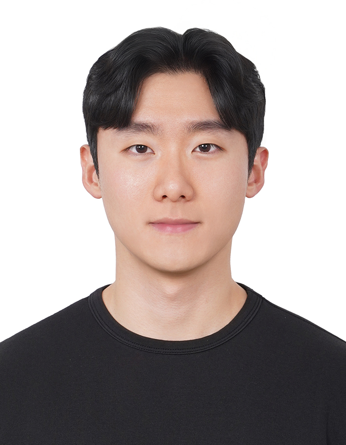

## Biography

[Chanwoo Kim](https://scholar.google.com/citations?user=2EvVP-UAAAAJ&hl=en) is an M.S. student in the [School of Software at Soongsil University](https://sw.ssu.ac.kr/), where he conducts research at the [Natural Language Processing Lab](https://sites.google.com/view/ssu-nlp/home). Prior to beginning his graduate studies, he worked as an AI Software Engineer in industry. His experience spans the training and development of large language models (LLMs), as well as building LLM-based agents. For more details, please see his [CV](cv.pdf).

## Research Interest

- Large Language Model (LLM)
- LLM Agent
- Reinforcement Learning

## Education

- **2026.09 - 2028.08 (Expected)**: M.S. in [School of Software](https://sw.ssu.ac.kr/), Soongsil University (Advisor: [Prof. Chanjun Park](https://parkchanjun.github.io/))
- **2017 - 2023**: B.S. in [School of Software](https://sw.ssu.ac.kr/), Soongsil University

## Work Experiences

- **2023 - 2025**: Anipen Inc, AI Software Engineer

## Additional Links

- [Google Scholar](https://scholar.google.com/citations?user=2EvVP-UAAAAJ&hl=en)
